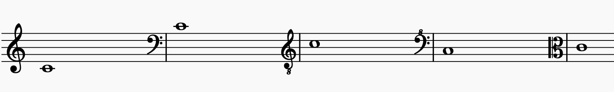
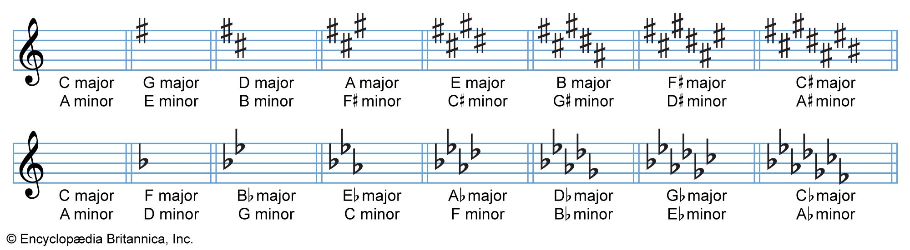
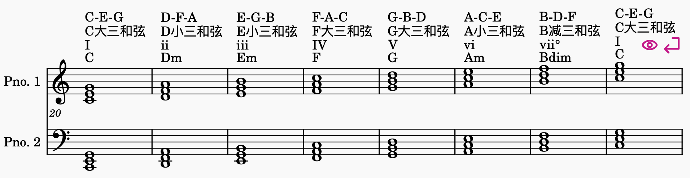
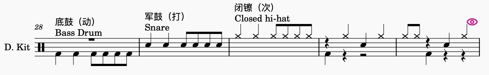
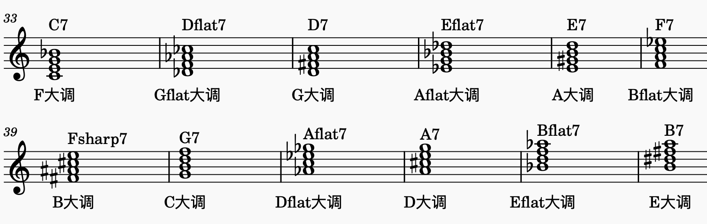
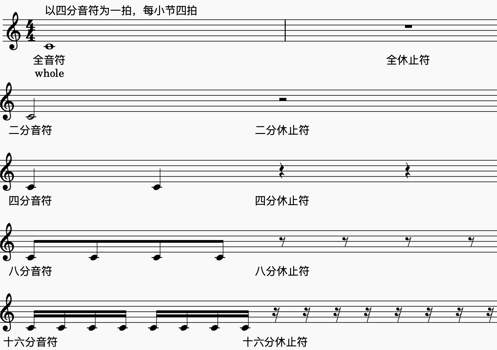
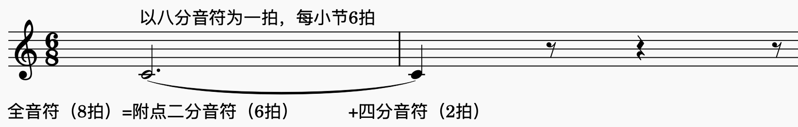
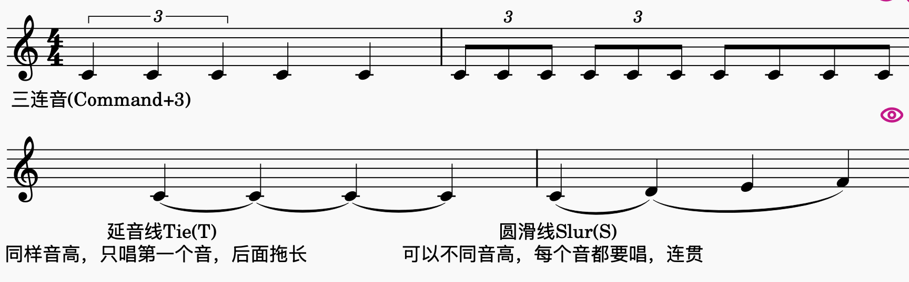
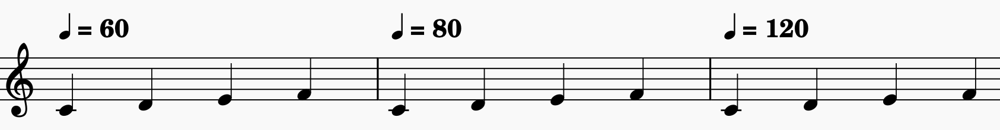
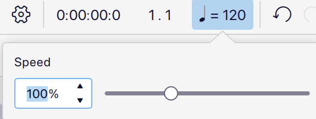

# 快速写谱Cheat Sheet

1. MuseScore常用快捷键

   | 操作               | 常用方式                                |
   | ------------------ | --------------------------------------- |
   | 进入／退出音符输入 | N／Esc                                  |
   | 选择时值           | 数字键 1–7，见上表                      |
   | 输入音高／休止符   | A–G／0                                  |
   | 添加附点           | .                                       |
   | 调整已选音符的音高 | ↑／↓                                    |
   | 升／降一个八度     | Windows：Ctrl＋↑／↓；Mac：Cmd＋↑／↓     |
   | 复制／粘贴         | Windows：Ctrl＋C／V；Mac：Cmd＋C／V     |
   | 延音线（Tie）      | T；连接同音高的音，时值相加，不重新起音 |
   | 圆滑线（Slur）     | S；连接一组音，表示连贯的乐句           |
   | 三连音（Triplet）  | Command + 3                             |

2. 主旋律

   1. 谱号
   2. 调号
   3. 拍号：“x/y” = 每y分音符为一拍，每小节x拍
   4. 速度：“四分音符=x” = 每分钟可以演奏x个四分音符

3. 和弦

   1. 吉他谱常见和弦（C大调，如果不是记得转调）

   2. 声部音域

      | 声部     | 舒适音域（超出需要确认） |
      | -------- | ------------------------ |
      | Soprano  | G3-E5                    |
      | Alto     | D3-B4                    |
      | Tenor    | C3-G4                    |
      | Baritone | F2-E4                    |
      | Bass     | D2                       |

4. BeatBox

5. 属七和弦转调

# 阿卡贝拉编曲 Workshop 

从构思、主旋律、和弦到 Beatbox，完成一份可以开始排练的阿卡贝拉谱。

## Step 1｜构思

### 1. 选哪些歌？

先选你喜欢、觉得好听、想唱的歌，再考虑是否适合现有成员的音域与演唱能力。

### 2. 什么主题？

**如果是一首歌**，不同主题可能呈现不同的效果，例如：

「如愿」，「这世界那么多人」：每个声部都有solo的群像感 vs 单一solo的叙事感

可以思考：相比于原版，阿卡贝拉版本能给这首歌带来什么不同的惊喜？例如：

「Lovely」：相比于原曲单纯男女对唱，阿卡贝拉版加入了很美的琶音，很多和声，sop的高音吟唱等等

**如果是多首歌**，主题可以帮助选歌和组织段落，例如：

「周杰伦组曲·四季」：四首歌代表四个季节，四个阶段

「K/DA」：各种英雄联盟主题曲

「野心家」：女性困境与成长

「动画组曲」：各种童年动画片主题曲

也可以从灵感和好听出发，just for fun：，例如「Shape of 山歌」。

也可以没有主题，就是把喜欢的歌拼在一起，但听的人可能会懵懵的。

### 3. 什么形式？

| 形式 | 简洁说明 | 需要注意的特点 | 例子 |
| --- | --- | --- | --- |
| 单曲 | 简单快速，好编好学。 | 保留原曲的旋律与结构，注意阿卡贝拉的优劣势（例如阿卡贝拉很难唱出电子音乐/个性鲜明的乐器e.g.竹笛/唢呐）。 | 情非得已，Lovely... |
| Medley（组曲） | 将多首歌的片段依次拼接。 | 突出主题，处理段落衔接、速度变化和转调。 | 林俊杰组曲，邓紫棋组曲... |
| Mashup（混搭） | 除了拼接，还让不同歌曲的旋律交错或重叠。 | 重叠部分的和弦、拍子和乐句长度要兼容。 | K/DA，Shape of 山歌，野心家... |
| Remix（改编） | 重新设计原曲的和弦、节奏或结构。 | 更需要灵感与乐理支撑；先明确想改变什么，不要为了改编而改编。 | - |

### 4. 大歌还是小组？

| 性质 | 发起要求 | 编曲时的考虑 |
| --- | --- | --- |
| 大歌 | 全员投票，大家的演唱意愿足够强。 | 考虑整体气势和大舞台效果，也考虑观众接受度、歌词与表演传递的 message。 |
| 小组 | 每个所需声部至少有一人即可发车。 | 以成员喜好为主，长度灵活；人数少时，要确认各条声部都能独立承担作用。 |

## Step 2｜主旋律

### 1. 建立 MuseScore 乐谱

新建空白谱，添加需要的声部，并修改声部名称：

可以直接选择人声声部（Soprano, bass etc.），再在 Mixer（混音器）中把回放音色设为 Piano，方便听清音高。

可以直接全都选 Piano，然后在左侧的“Layout” tab中删除不用的那一条谱表，只保留单谱表，再改成声部名。

### 2. 音名与唱名

**音名** 是 C、D、E 等固定音高名称； **首调唱名** 是 Do、Re、Mi 等，随调性变化。

| 简谱级数 | 1 | 2 | 3 | 4 | 5 | 6 | 7 |
| --- | --- | --- | --- | --- | --- | --- | --- |
| 首调唱名 | Do | Re | Mi | Fa | Sol | La | Ti（Si） |
| C 大调音名 | C | D | E | F | G | A | B |

这组音名对应只适用于 C 大调：例如 D 大调的 1 是 D。

**全音和半音：**相邻白键中，E–F、B–C 是半音（中间没有黑键），其余是全音；一个全音等于两个半音。

### 3. 谱号（Clef）

谱号决定五线谱上的位置对应哪个音。先找一个定位音，C4 指中央 C，再按「线—间—线—间」逐级读音；五条线从下往上数。

| 谱号 | 定位方法 | 常见用途 |
| --- | --- | --- |
| 高音谱号 | 中央 C（C4）在下加一线。 | Soprano, Alto |
| 下方写小「8」的高音谱号 | 中央 C（C4）在第三间（高音谱号的C5），下加一线是C3。也就是说和高音谱号一样识谱，但实际演唱比谱面低一个八度。 | Tenor |
| 低音谱号 | 中央 C（C4）在上加一线。 | Baritone, Bass |

### 4. 调号（Key signature）

调号写在谱号后，规定哪些音默认升高或降低半音，同名音在各八度都受影响；临时升降号则用于局部改变。

- **升号顺序：** F、C、G、D、A、E、B。最后一个升号音再升半音，就是大调主音，例如 F♯ → G 大调。
- **降号顺序：** B、E、A、D、G、C、F。倒数第二个降号音就是大调主音；只有一个降号时是 F 大调。
- **没有升降号：** C 大调，也可能是 A 小调。每个调号都对应一组关系大小调，要结合旋律和终止感判断。

### 5. 拍号与音符时值

拍号的上方数字表示每小节有几个下方数字所代表的音符单位。4/4 是每小节四个四分音符单位，6/8 是六个八分音符单位，通常按「3＋3」感受成两个大拍。

以下以 **四分音符为一拍** ：

| 音符/休止符 | 时值 | MuseScore 数字键 |
| --- | --- | --- |
| 全音符 | 4 拍 | 7 |
| 二分音符 | 2 拍 | 6 |
| 四分音符 | 1 拍 | 5 |
| 八分音符 | 1/2 拍 | 4 |
| 十六分音符 | 1/4 拍 | 3 |
| 三十二分音符 | 1/8 拍 | 2 |
| 六十四分音符 | 1/16 拍 | 1 |

**附点:** 增加原时值的一半, 例如附点四分音符是 1.5 拍

**三连音:** 通常把三个同等音符放进原本两个音符的时间内

**延音线（Tie）:** 连接同音高的音，时值相加，不重新起音

**圆滑线（Slur）:** 连接一组音，表示连贯的乐句

### 6. 速度（Tempo）

Tempo 决定音乐进行的快慢。标记「♩ = 100」表示每分钟 100 个四分音符。

在 MuseScore 中选中起始音符或休止符，从「速度」面板添加标记，并修改 BPM；中途变速就在对应位置添加新的标记。

回放区域的速度滑杆用于临时放慢或加快试听，不等于修改谱面速度。练习后恢复到 100%，再判断实际速度；

回放区域的时间显示也可用于查看预估时长。

### 7. 开始扒谱与输入旋律

**扒谱** 就是把听到的音高与节奏记下来。先按短乐句分段，确认节奏，再输入音高，最后回放核对。

#### MuseScore Studio 常用默认快捷键整理

MuseScore官方教程：https://handbook.musescore.org/en_gb/basics/default-keyboard-shortcuts

| 操作 | 常用方式 |
| --- | --- |
| 进入／退出音符输入 | N／Esc |
| 选择时值 | 数字键 1–7，见上表 |
| 输入音高／休止符 | A–G／0 |
| 添加附点 | . |
| 调整已选音符的音高 | ↑／↓ |
| 升／降一个八度 | Windows：Ctrl＋↑／↓；Mac：Cmd＋↑／↓ |
| 复制／粘贴 | Windows：Ctrl＋C／V；Mac：Cmd＋C／V |
| 延音线（Tie） | T；连接同音高的音，时值相加，不重新起音 |
| 圆滑线（Slur） | S；连接一组音，表示连贯的乐句 |
| 三连音（Triplet） | Command + 3 |

- **推荐自己听音扒一遍：** 先专注音高与节奏，不必同时设计伴奏，也能练习快速切换时值和输入音符。
- **有相对音感：** 可以先把大调旋律按 C 大调的级数关系写出，再使用 Transpose（移调）整体转到目标调；小调也可以先用熟悉的小调记录。
- **听不出来或时间有限：** 可以参考现成谱子。先回放几秒确认版本、调性与原曲是否一致，再检查节奏和临时升降号。

## Step 3｜和弦

### 1. 音程与三度和声

**音程（Interval）** 是两个音之间的距离。数音程时把起点和终点都算进去，例如 C–E 跨过 C、D、E，是三度。

- **大三度：** 4 个半音，例如 C–E。
- **小三度：** 3 个半音，例如 E–G。
- **三度和声：** 在旋律上方或下方隔一个音级唱，通常沿当前音阶移动，所以大三度、小三度会交替出现，偶尔还有四度和五度。（例子：周杰伦四季-稻香）

例如 C 大调旋律 C–D–E，上方三度是 E–F–G；三组音程依次为大三度、小三度、小三度。即兴时还要听当前和弦，必要时调整音，不能把所有旋律音机械地升高 4 个半音。

### 2. 自己怎么找和弦？

推荐先听低音（Bass），它常能提供和弦线索，再用旋律和其他伴奏音验证。

**低音不一定是根音。** 根音是和弦命名的基础，例如 C 和弦的根音是 C；转位、经过音或持续低音都可能让最低音变成别的音。

### 3. 听不出来怎么办？

参考吉他谱中的和弦标记。先确认它写的是实际调，还是使用 Capo（变调夹）的指型调：例如 C 指型配 Capo 2，实际响的是 D 调。

可以找 C 调版本便于理解，也可以把现有和弦统一移调；最终要与自己写的旋律处在同一个调。

### 4. C 大调的基本和弦

**三和弦** 由根音、三音、五音组成；三音决定常见三和弦的大、小性质。C 大调沿音阶隔一个音叠起来，得到：

| 级数 | 和弦记号 | 名称 | 构成音 |
| --- | --- | --- | --- |
| I | C | C 大三和弦 | C–E–G |
| ii | Dm | D 小三和弦 | D–F–A |
| iii | Em | E 小三和弦 | E–G–B |
| IV | F | F 大三和弦 | F–A–C |
| V | G | G 大三和弦 | G–B–D |
| vi | Am | A 小三和弦 | A–C–E |
| vii° | Bdim | B 减三和弦 | B–D–F |

**大三和弦**是「大三度＋小三度」；

**小三和弦**是「小三度＋大三度」（标识里带m的就是小三和弦）；

减三和弦是两个小三度（dim）。

所以如果要把大三和弦变成小三和弦，例如C变成Cm，我们只需要把三音（中间的音）降一个半音，就可以把大小三度互换。

**级数：**流行音乐里的4536251，1645等等指的就是这个数字对应级数的和弦。

**第一转位：**把三度音放在最低处，e.g. C/E代表C大三和弦第一转位，也就是以E为最低的音

**第二转位：**把五度音放在最低处，e.g. C/G代表C大三和弦第二转位，也就是以G为最低的音

### 5. 根据声部音域分配和弦

先让 Bass 唱根音作为稳定基础，再把三音、五音分给其他声部。**可以作为和弦，也可以作为主旋律的和声。**

已有主旋律也属于整体和声的一部分，不必每个伴唱声部都重复它。

例如 C 和弦可以分成 Bass 唱 C3、中声部唱 G3、上声部唱 E4；具体八度按成员音域调整。

连接下一个和弦时，尽量保留共同音、选择近距离移动，让每条声部单独唱也顺口。

#### 各声部音域：

| 声部     | 舒适音域**（非常重要！！！超出要和成员确认效果）** |
| -------- | -------------------------------------------------- |
| Soprano  | G3-E5                                              |
| Alto     | D3-B4                                              |
| Tenor    | C3-G4                                              |
| Baritone | F2-E4                                              |
| Bass     | D2                                                 |

## Step 4｜Beatbox

MuseScore乐器选“Percussion-Unpitched”里的“Drum Kit (Large/Medium/Small都可以) ”，至少需要有如下三个音：

| 鼓组声音 | Beatbox 对应 | 作用 |
| --- | --- | --- |
| Bass Drum（底鼓） | B／爆破低鼓音 | 动 |
| Snare（军鼓） | Pf／K 等军鼓音 | 打 |
| Closed hi-hat（闭镲） | t／ts | 次 |

基础 4/4 可以就按照“动次打次”，可以自己稍微发挥一下，比如”动次打次，次打动次“。

一般会放 Bass Drum在最重的拍，Snare 在第二重而且比Bass Drum听起来音调高一点的拍，闭镲放八分音符或反拍或轻一点的拍的位置，再按歌曲调整。

## Step 5｜如何转调

**转调（Modulation）** 是在歌曲中途改变调性；前面使用 Transpose 是把一整段或整首谱统一搬到另一个调。

在Medley和Mashup中，想要编写的歌往往都不在同一个调上，转调能把它们更丝滑地连在一起，同时也让大家更容易找到音。

| 方法 | 简洁说明 | 需要注意 |
| --- | --- | --- |
| 直接写成同一个调   | 把所有想编的歌写成同一个调，不需要中途转调      | 注意声部音域                                                 |
| 升高半音           | 常见的最后一遍副歌做法，例如 C 大调 → D♭ 大调。 | 会增加演唱强度；先检查主旋律与所有声部的最高音。也可以通过过渡和弦准备。 |
| 硬转               | 直接进入新调，不铺垫完整的过渡和弦。            | 找一个锚点：两个调的共同音、能记住的旋律音，或先出现的目标调低音，帮助大家找到起音。e.g.周杰伦四季-稻香转七里香 |
| 找目标调的属七和弦 | 先唱目标调的 V7，再落到目标调的 I。             | 属七和弦产生导向新主音的张力；注意各声部的连接。e.g.周杰伦四季-七里香转枫 |

**七和弦：**在三和弦上加一个距离根音七度的音，共四个音。

**属七和弦：**大三和弦（大三度+小三度），再加上小三度，所以也被称为大小七和弦。

例如转到 G 大调，可以用 **D7 → G** ：D7 的音是 D–F♯–A–C，其中 F♯ 常上行到 G，C 常下行到 B。转到 C 大调则是 **G7 → C** 。

## Step 6｜如何编排得好听

更有创意的 Arrangement（编排方式）留到下期，这次先记住几个小 tips：

1. **一定一定写在各声部舒适音域内。** 前面的舒适音区表格不包括偶尔能碰到的最高、最低音，如果有长时间超出舒适区的编排一定要向成员确认效果，要考虑能否连续稳定地唱，也留出换气位置。
2. **Unison 简单、好唱、好听。** 让多个声部唱同一条旋律，能集中力量、突出歌词；不同八度一起唱也能达到类似效果。
3. **慎用转位。** 转位是把和弦的三音或五音放在最低处；它能让 Bass 更流畅，但可能带来不同的和弦色彩，先理解低音变化带来的效果，再有目的地使用。
4. **Bass 尽量保持支撑。** 突然缺少低音会让整体明显变薄；需要留白时可以有意拿掉，再让它回来形成对比。
5. **留意最高声部。** 高音线通常更容易被听见；检查它是否形成了抢走主旋律注意力的另一条旋律，并调整音量、音区或节奏。
